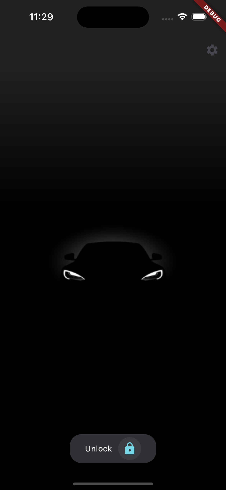
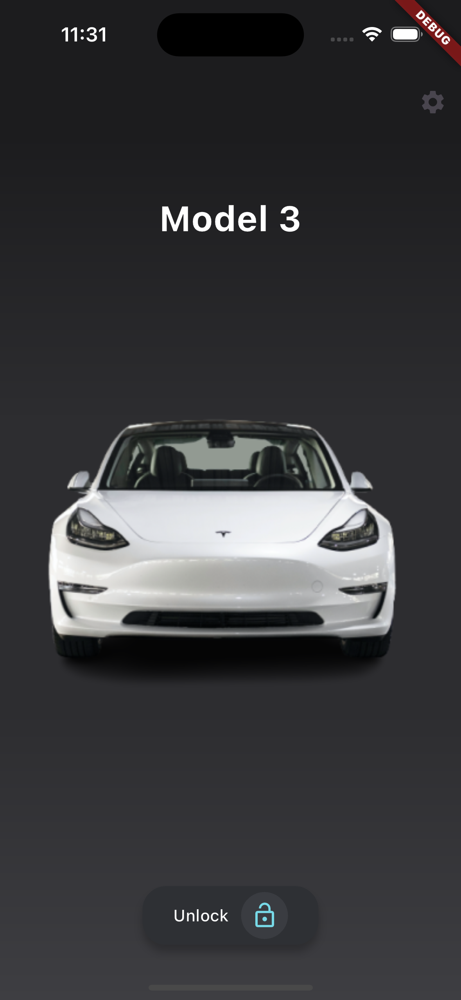

# flutter_tesla

Esta aplicación es una representación de la interfaz de usuario (UI) para una aplicación dedicada a carros. A continuación, se muestra una vista previa de cómo se ve la UI:

<table>
  <tr>
    <td>
      
    </td>
    <td>
      
    </td>
  </tr>
</table>